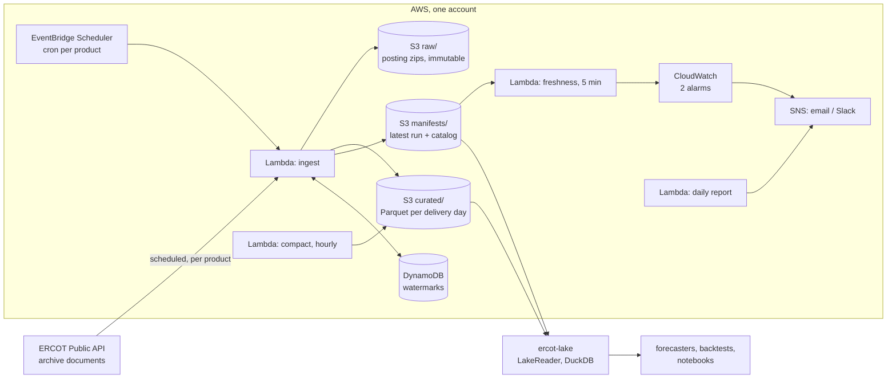

# ercot-pit-lake

A point-in-time data lake of ERCOT market data, and the serverless AWS pipeline that fills it.

Every ERCOT posting (settlement point prices, ancillary-service clearing prices, SCED LMPs,
load, wind and solar forecasts) is kept exactly as published. Curated Parquet carries both
ERCOT's posting time and ours. You can ask the lake **what was known at any moment**, with
corrections and reposts included.

## Why point-in-time

ERCOT revises what it publishes. A day-ahead forecast is replaced several times before the
day arrives, and prices are occasionally reposted. A table holding only the latest value
answers "what happened", but not "what could anyone have known at 10:03 yesterday". A
backtest or a forecaster trained on the latest values sees the future, and looks better than
it will ever be live.

This lake keeps every posting. A read takes an `as_of` time and returns, for each interval,
the latest posting made at or before it:

```
posted_at <= as_of, then the latest posting per business key
```

The reader library enforces this rule, and has no "latest, ignoring time" shortcut.

## Architecture



- **One code path.** Live runs and backfills run the same loop over ERCOT's archive documents
  and produce identical partitions. Re-running any window overwrites the same keys.
- **Raw is immutable.** Each posting is stored as received before it is parsed, so the curated
  zone can always be rebuilt.
- **Products are configuration.** `config.yaml` lists every product, its schedule, freshness
  threshold and column mapping. Adding a report of an existing table family needs no code.
- **Serverless and small.** EventBridge Scheduler, Lambda, S3 and DynamoDB, sized for the AWS
  free tier: two CloudWatch alarms and one metric family, however many products.

The interface consumers rely on (layout, schemas, business keys, the read rule, manifests,
versioning) is [docs/CONTRACT.md](docs/CONTRACT.md). The decisions behind the design are in
[docs/adr/](docs/adr/README.md), and releases in [CHANGELOG.md](CHANGELOG.md).

## Try it offline

No ERCOT account and no AWS needed: the committed samples are real ERCOT postings, and the
whole pipeline runs on them into a local lake.

```
make setup
make ingest OFFLINE=1          # ten products -> ./data (raw zips, curated Parquet, catalog)
make verify                    # the lake against the contract
```

```python
from datetime import UTC, date, datetime
from ercot_lake import LakeReader

with LakeReader("./data") as lake:
    before = lake.spp_by_date(
        "np4-190-cd", date(2026, 9, 29), as_of=datetime(2026, 9, 28, 18, 51, 10, tzinfo=UTC)
    )
    after = lake.spp_by_date(
        "np4-190-cd", date(2026, 9, 29), as_of=datetime(2026, 9, 28, 18, 51, 11, tzinfo=UTC)
    )
    print(before.num_rows, after.num_rows)  # 0 40: nothing is known before it was posted
```

## Consuming the lake

Install the read library at a release tag. It needs DuckDB and pyarrow, nothing AWS-specific:

```
pip install "ercot-lake @ git+https://github.com/edunca01/ercot-pit-lake@lake-v1.0.0#subdirectory=lake"
```

A consumer in the deploying account finds the lake through SSM parameters under
`/ercot-pit-lake/` (`lake_bucket`, `lake_read_policy_arn`, `region`, `contract_version`), and
attaches the `ercot-lake-read` policy to its role. That policy can list and read `curated/`
and `manifests/` only. Credentials come from the standard AWS chain:

```python
with LakeReader("s3://<lake bucket>", region="us-east-2") as lake:
    print(lake.products())
    # intervals in [start, end), as known at as_of
    prices = lake.spp_by_range(
        "np6-905-cd",
        datetime(2026, 9, 1, 5, tzinfo=UTC),  # midnight CDT
        datetime(2026, 9, 8, 5, tzinfo=UTC),
        as_of=datetime(2026, 9, 8, 5, tzinfo=UTC),
    )
```

The contract is versioned with SemVer and released as `lake-vX.Y.Z`. The reader refuses a
lake written under an incompatible major version, or rows of a schema version it does not
know, rather than guessing.

## Develop

Open in a Codespace or the dev container, or locally with `uv` and Python 3.12:

```
make setup
make check        # lint, mypy strict, tests; offline, no credentials
make tf-test      # Terraform validate + tests against a mocked AWS provider
make ingest       # live, from the watermark (needs ERCOT_* credentials, see .env.example)
uv run backfill --product np4-190-cd --from 2026-09-01 --to 2026-09-02 --source bundles
make docker-build # the Lambda image
```

## Deploy your own copy

[infra/](infra/README.md) holds one Terraform module per layer and an example root that deploys
the whole stack into your account: state bucket, image, credentials secret, optional email and
Slack. Schedules come from `config.yaml`, so adding a product never touches Terraform. This
repository deploys nothing itself; a deployment is its own Terraform root with its own
credentials.

## Contributions

This is a portfolio project and does not take pull requests. You are welcome to fork it and
run it on your own AWS account. Report security issues privately: [SECURITY.md](SECURITY.md).

## License

MIT for the code ([LICENSE](LICENSE)). The files in `samples/` are ERCOT public market
information, redistributed under ERCOT's terms of use.
